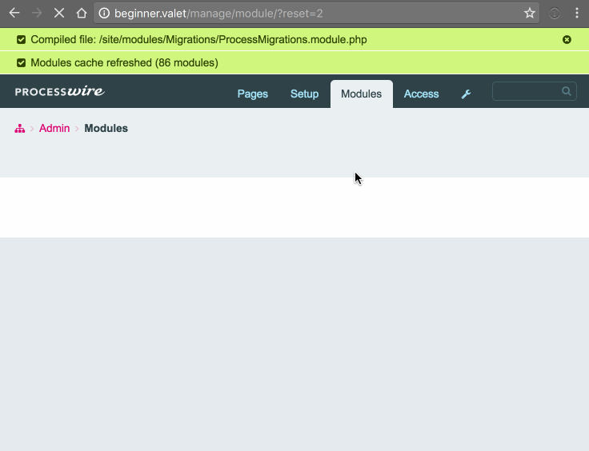
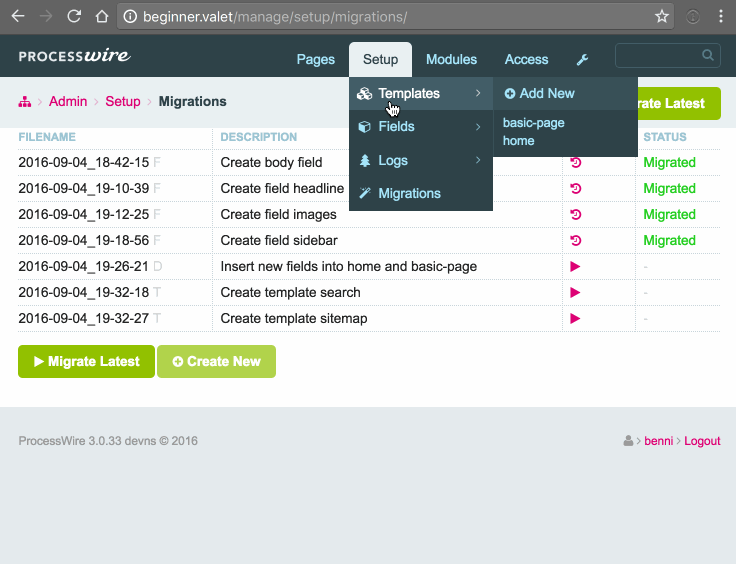

# Migrations Module

Today I want to show you guys a quick primer on my migrations module. It's a module to handle any changes happening to the ProcessWire database on a development server and the ability to automatically recreate them on a running live system or any other secondary server.

For demonstration purposed I'll simply recreate the fields/templates and pages present in the beginner site profile, but starting from a blank-profile installation (I missed the summary field, but everything was already recorded).

If you want to work along. I've started with a plain 3.0.33 installation and nothing more than the blank profile installed.

## Getting Started

We start of by installing the module through composer. The module can be used without composer, but the CLI won't work that way. Go to your root directory and run `composer require lostkobrakai/migrations`. I've used the `0.2.x-dev` version, because at the time of recording the cli update was still in the makings.

Now that the files are in the correct place install the module via the admin interface and create a new folder `site/migrations` for your migrations to be stored in.

## First Step: Body Field

For the first migration we'll be using the admin interface. I'm personally almost never using it to create migrations, but mostly to run them on external servers if I'm not connected by ssh.

So we create a new FieldMigration for the body field. 

This will create a new file in our newly created path `site/migrations`. It's already filled with a bit of boilerplate code needed to create the field, but it's missing all the crucial settings. So let add them in.

With that we've build a kind of a blueprint for the body field. That blueprint can now be used to spin up the described field and also to remove it again if the migration might be rolled back. Now we can either use the admin backend again to run the migration, but I like to stay in the CLI, because this might be the less obvious path for some of you. The ones of you working with any kind of npm, gulp or other js script will have open terminals anyway.

## Further Fields

In the following recording I'll add the other fields (besides the missing summary). You'll see, that the CLI tool does allow for a even faster workflow in creating those migrations as a few more fields are simple to prefill by providing options to the creation command. 

You might have notices I haven't edited the sidebar field by now. That's because I wanted to create this a bit differently. The summary is the same field as the body field with just the difference of being collapsed when blank. So it makes sense to simply copy the body fields instead of supplying all the options again. The FieldMigrations class does still have a update/downgrade functionality like the default migrations. We can simply overwrite the manual creation of the field with our custom logic to clone the field. We'll still leave the downgrade handling to the parent class, because it does already know how to remove a field again.

## Templates

Now as the fields are done we're going to add those fields to some templates. The first two of those are already there in the blank profile: home & basic-page. As those will also get the same fields assigned it's probably the simplest to use just a single migration file. As we'll edit already existing items we'll use default migrations and not one of the blueprint ones like for the fields.

(Let's see if you can spot the typo in the code =)

In the next one I'll again fill in the rest with the other two templates. As those are new ones I'll use TemplateMigrations like for the fields to save me some boilerplate.

## Conclusion ?!

Now we've spent a bunch of time creating all those migrations to mimik what we could've done in the backend in the same time. We'll that's true for as long as those changes don't need to be transfered anywhere. Imagine you've a quite buzy website and you wouldn't want to have half an hour downtime just to move all those template and field changes to the server. Even remembering all the done changes can be a task in itself. Migrations solve that by applying changes within seconds. 

Also the workflow of creating migrations does allow for a more obvious communication of changes in teams. It's always easy to think of own changes, but what about those of your colleagues.

## Caveats

To use this really efficiantly one does need to have a good bit of knowledge of the ProcessWire api and core functionality, but I hope with the new 3.0 docs this will get easier. A lot of overall field/template settings are already documented quite well (IDE and autocomplete ftw in this case), but some are still missing.

The simplest way to find out the name of a settings is simply by enabling debug mode and hovering over the "collapse" arrow. Just keep in mind everything beginning with an underscore is ofter saved differently than under that name. 

I fully understand that the above issues can be a bit of a dealbreaker for some people, which is why I'm thinking about creating bootstrap migrations for most fieldtypes, where all the possible settings are listed. Additionally I'll try out the possiblity to bootstrap migrations from already existing fields. I'm still a bit torn on this one, as there are multiple advantages on not creating full fields via the backend, but I'll see. 